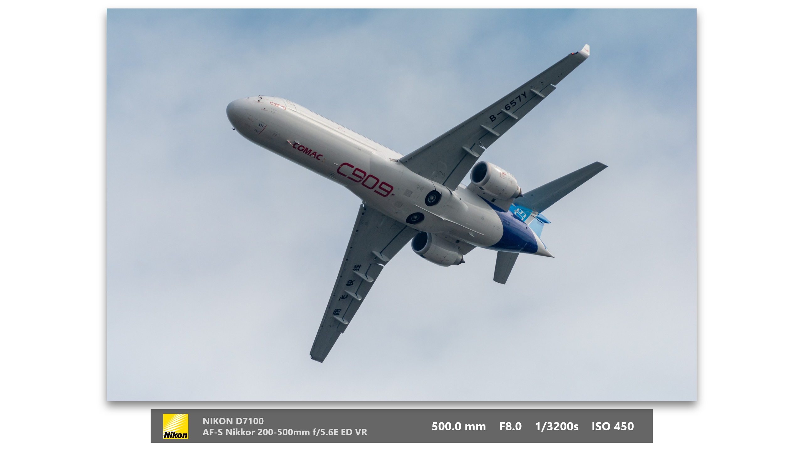
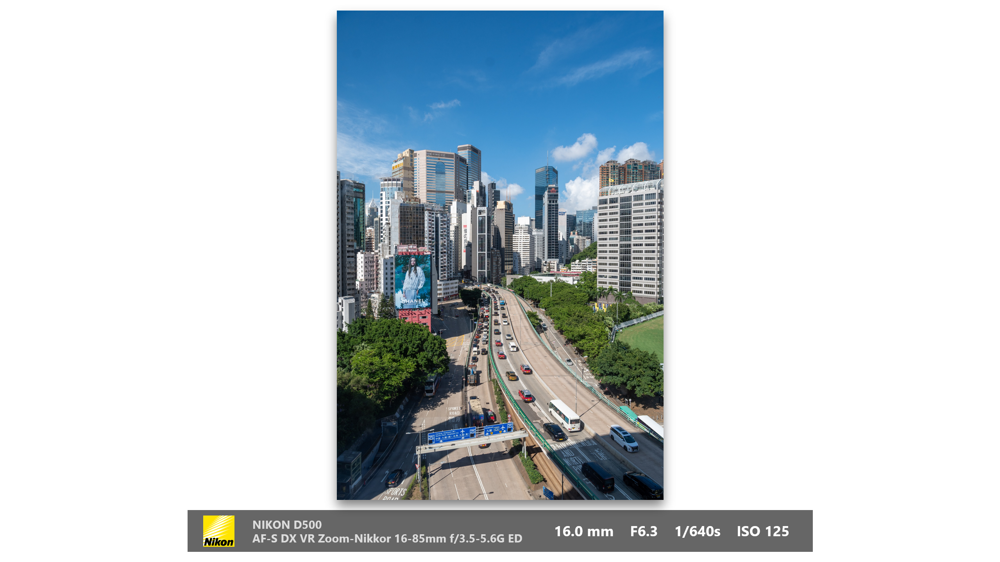

**[English](README_EN.MD)**

# PowerPoint 照片参数横幅批量生成宏

这是一个为摄影爱好者和专业人士设计的 PowerPoint VBA 宏。它能够**批量处理**多张照片，为每一张照片自动创建一个新的幻灯片，并附上一个专业、美观的拍摄参数横幅。

本宏通过预先读取由 ExifTool 生成的 CSV 数据文件，彻底解决了因系统环境差异导致的 EXIF 信息读取失败问题，确保了极高的运行稳定性和效率。

## 核心特性

*   **批量处理**: 支持一次性选择多张照片，宏会自动为每张照片创建新幻灯片并添加横幅，极大提升效率。
*   **性能卓越**: 采用一次性数据加载机制，首次运行后将所有照片数据读入内存，处理大量照片时依然响应迅速。
*   **高稳定性**: 通过读取外部 CSV 文件而非直接解析图片，绕开兼容性问题。
*   **智能报告**: 批量处理结束后，会提供一份清晰的报告，告知成功处理了多少文件，以及哪些文件因数据缺失而被跳过。
*   **专业外观**: 自动为图片添加阴影，横幅采用半透明设计，字体和布局经过精心排版。
*   **高度可配置**: 用户可以轻松修改 Logo 路径、数据文件路径，并对横幅布局进行微调。



## 使用流程

请严格按照以下四个步骤进行配置和使用。

### 步骤 1：准备工作

1.  **ExifTool**: 下载 `ExifTool` Windows 可执行版本。从官网 ([https://exiftool.org/](https://exiftool.org/)) 下载后，将 `exiftool(-k).exe` 文件名重命名为 `exiftool.exe`。
2.  **相机Logo**:
    *   **网络图片 (默认)**: 代码中已默认使用一个在线的尼康Logo链接，使用方便但需要网络连接。
    *   **本地图片 (推荐)**: 为了更快的加载速度和离线使用的便利性，建议您将Logo图片下载到本地，并在代码中修改为本地文件路径（例如 `C:\MyLogos\Nikon.jpg`）。
    *   **其他品牌**：你可以将其修改为其他品牌的logo，本脚本展示不能支持自动切换相机品牌。

### 步骤 2：生成 EXIF 数据文件

这是整个流程中最关键的一步。

1.  将 `exiftool.exe` 文件复制到您存放**所有**照片的根文件夹中（例如 `E:\成片`）。
2.  在该文件夹中，按住 `Shift` 键并点击鼠标右键，选择“在此处打开 PowerShell 窗口”或“在此处打开命令提示符窗口”。
3.  **依次**输入并执行以下两条命令：

    *   第一条命令用于确保命令行能正确处理中文字符：
      ```bash
      chcp 65001
      ```

    *   第二条命令用于运行 ExifTool，扫描所有照片并生成数据文件 `exif_data.csv`：
      ```bash
      .\exiftool.exe -csv -r -charset filename=utf8 -FileName -Model -LensID -FocalLength -FNumber -ExposureTime -ISO . > exif_data.csv
      ```

4.  **重要**: 命令运行成功后，用 **Notepad（记事本）** 打开新生成的 `exif_data.csv` 文件，然后选择 **文件 -> 另存为**，在弹出的窗口中，将底部的**编码**格式选择为 **`UTF-8 with BOM`**，然后保存并覆盖原文件。这一步能确保VBA正确读取文件内容。

### 步骤 3：在 PowerPoint 中安装和配置宏

1.  打开 PowerPoint，按下 `Alt + F11` 进入 VBA 编辑器。
2.  在编辑器菜单栏，点击 **插入 -> 模块**，创建一个新的空白代码模块。
3.  将下面的 **【完整宏代码】** 完整地复制并粘贴到这个新模块中。
4.  **修改配置**: 在代码的最上方，找到并修改以下两行常量，将其路径替换为您自己的实际路径：
    ```vb
    Const NIKON_LOGO_PATH As String = "https://i1.wp.com/..." ' 或修改为本地路径 "C:\path\to\your\logo.jpg"
    Const CSV_FILE_PATH As String = "D:\path\to\your\photos\exif_data.csv"
    ```5.  **添加快捷方式 (推荐)**:
    *   回到 PowerPoint 主界面，点击 **文件 -> 选项 -> 快速访问工具栏**。
    *   在“从下列位置选择命令”下拉菜单中选择“宏”。
    *   找到名为 `CreateBannersOnNewSlides_Batch` 的宏，点击“添加”。
    *   您可以点击“修改”为它选择一个喜欢的图标。
    *   点击“确定”保存。

### 步骤 4：运行宏

点击您刚刚添加到快速访问工具栏上的图标，然后在弹出的窗口中，**按住 `Ctrl` 或 `Shift` 键选择一个或多个**您想插入的照片，点击“打开”即可开始批量处理。

## 效果微调

您可以轻松微调横幅的布局以达到最佳视觉效果。在 VBA 代码中找到 `PositionAndCreateLayout` 子程序进行修改。

**以下参数是作者根据个人审美调节出的最佳效果，您可以根据自己的需求进行修改。**

1.  **横幅宽度**:
    ```vb
    ' --- 【横幅宽度调节】---
    Const FIXED_BANNER_WIDTH As Single = 600 ' <--- 在这里修改为你想要的宽度
    ```

2.  **图片与幻灯片上下的间距 (安全区)**:
    ```vb
    ' --- 【安全区调节】---
    ' 0.87 表示图片和横幅的总高度最多占幻灯片高度的87%，但是注意留白包括横幅范围。
    safeHeight = sldHeight * 0.87
    ```

---

## 完整宏代码

```vb
Option Explicit

' --- 全局变量与常量 ---
Private exifCollection As Object
' !!! 重要：请根据您的实际情况修改下面这两行路径 !!!
' Logo可以使用网络链接，但为了更快的速度和离线使用，建议下载到本地并使用本地路径。
Const NIKON_LOGO_PATH As String = "https://i1.wp.com/naturebyandreas.se/wp-content/uploads/2015/10/nikon-logo.jpg"
Const CSV_FILE_PATH As String = "E:\成片\exif_data.csv"

' =========================================================================
' --- 主宏程序 ---
' =========================================================================
Public Sub CreateBannersOnNewSlides_Batch()
    On Error GoTo ErrorHandler

    Dim fileDialog As Object
    Dim imagePath As Variant
    Dim imageName As String
    Dim oSlide As Slide
    Dim oPicture As Shape
    Dim exifData As Variant
    Dim processedCount As Long
    Dim failedFiles As String

    ' --- 步骤 1: 一次性加载全部EXIF数据 ---
    If LoadExifData() = False Then Exit Sub

    ' --- 步骤 2: 打开文件选择对话框，并允许多选 ---
    Set fileDialog = Application.fileDialog(msoFileDialogFilePicker)
    With fileDialog
        .Title = "请选择一个或多个照片文件 (可按住 Ctrl 或 Shift)"
        .AllowMultiSelect = True
        .Filters.Clear
        .Filters.Add "Images", "*.JPG;*.JPEG"
        
        If .Show <> -1 Then
            MsgBox "操作已取消。", vbInformation
            Exit Sub
        End If
    End With

    ' --- 步骤 3: 循环处理每一个选中的文件 ---
    processedCount = 0
    failedFiles = ""
    
    For Each imagePath In fileDialog.SelectedItems
        imageName = Mid(CStr(imagePath), InStrRev(CStr(imagePath), "\") + 1)

        If exifCollection.Exists(imageName) Then
            exifData = exifCollection(imageName)

            ' 为每张图片在末尾创建一张新的空白幻灯片
            Set oSlide = ActivePresentation.Slides.Add(ActivePresentation.Slides.Count + 1, ppLayoutBlank)
            Set oPicture = oSlide.Shapes.AddPicture(fileName:=CStr(imagePath), LinkToFile:=msoFalse, SaveWithDocument:=msoTrue, Left:=0, Top:=0)
            
            PositionAndCreateLayout oSlide, oPicture, exifData

            processedCount = processedCount + 1
        Else
            ' 记录找不到数据的文件名
            failedFiles = failedFiles & vbCrLf & " - " & imageName
        End If
    Next imagePath

    ' --- 步骤 4: 显示最终的处理报告 ---
    Dim finalMsg As String
    finalMsg = "批量处理完成！" & vbCrLf & vbCrLf & "成功为 " & processedCount & " 张图片创建了新页面。"
    
    If failedFiles <> "" Then
        finalMsg = finalMsg & vbCrLf & vbCrLf & "下列文件的数据未在CSV中找到，已跳过：" & failedFiles
    End If
    
    MsgBox finalMsg, vbInformation, "处理报告"

    ' --- 清理对象 ---
    Set fileDialog = Nothing
    Set oPicture = Nothing
    Set oSlide = Nothing
    
    Exit Sub

ErrorHandler:
    MsgBox "宏在运行过程中发生严重错误: " & Err.Description, vbCritical, "Macro Error"
End Sub


' =========================================================================
' --- 子程序 ---
' =========================================================================
Private Sub PositionAndCreateLayout(ByRef sld As Slide, ByRef pic As Shape, ByVal data As Variant)
    ' --- 【横幅宽度调节】---
    Const FIXED_BANNER_WIDTH As Single = 600 ' <--- 在这里修改为你想要的宽度

    Dim sldWidth As Single, sldHeight As Single
    Dim safeWidth As Single, safeHeight As Single
    Dim group As Shape
    Dim oBanner As Shape, oLogo As Shape, oTextBoxInfo As Shape, oTextBoxParams As Shape
    Dim infoText As String, paramsText As String
    Dim bannerHeight As Single, totalVisualHeight As Single, bannerTop As Single, bannerLeft As Single

    sldWidth = ActivePresentation.PageSetup.slideWidth
    sldHeight = ActivePresentation.PageSetup.slideHeight
    
    ' --- 【安全区调节】---
    ' 0.87 表示图片和横幅的总高度最多占幻灯片高度的87%，但是注意留白包括横幅范围。
    safeHeight = sldHeight * 0.87
    safeWidth = sldWidth * 0.95

    With pic
        .LockAspectRatio = msoTrue
        If (.Width / .Height) >= (safeWidth / safeHeight) Then
            .Width = safeWidth
        Else
            .Height = safeHeight
        End If
        
        With .Shadow
            .Type = msoShadow26
            .Visible = msoTrue
            .Blur = 12
            .Transparency = 0.5
            .OffsetX = 0
            .OffsetY = 6
        End With
    End With

    infoText = CStr(data(0)) & vbCrLf & CStr(data(1))
    paramsText = CStr(data(2)) & "    F" & CStr(data(3)) & "    " & CStr(data(4)) & "s    " & CStr(data(5))
    
    bannerHeight = 40
    totalVisualHeight = pic.Height + 10 + bannerHeight
    
    pic.Left = (sldWidth - pic.Width) / 2
    bannerLeft = (sldWidth - FIXED_BANNER_WIDTH) / 2
    
    pic.Top = (sldHeight - totalVisualHeight) / 2
    
    bannerTop = pic.Top + pic.Height + 10
    
    Set oBanner = sld.Shapes.AddShape(msoShapeRectangle, bannerLeft, bannerTop, FIXED_BANNER_WIDTH, bannerHeight)
    With oBanner
        .Fill.ForeColor.RGB = RGB(0, 0, 0)
        .Fill.Transparency = 0.4
        .line.Visible = msoFalse
    End With
    
    Set oLogo = sld.Shapes.AddPicture(NIKON_LOGO_PATH, msoFalse, msoTrue, 0, 0)
    With oLogo
        .LockAspectRatio = msoTrue
        .Height = 30
        .Left = oBanner.Left + 15
        .Top = oBanner.Top + (oBanner.Height - .Height) / 2
    End With
    
    Set oTextBoxInfo = sld.Shapes.AddTextbox(msoTextOrientationHorizontal, oLogo.Left + oLogo.Width + 10, oBanner.Top, oBanner.Width * 0.5, bannerHeight)
    With oTextBoxInfo.TextFrame2
        .VerticalAnchor = msoAnchorMiddle
        .TextRange.Text = infoText
        .TextRange.Font.Name = "Segoe UI"
        .TextRange.Font.Size = 11
        .TextRange.Font.Fill.ForeColor.RGB = RGB(220, 220, 220)
        .TextRange.Font.Bold = msoTrue
    End With
    
    Set oTextBoxParams = sld.Shapes.AddTextbox(msoTextOrientationHorizontal, oBanner.Left + oBanner.Width * 0.5, oBanner.Top, oBanner.Width * 0.5 - 15, bannerHeight)
    With oTextBoxParams.TextFrame2
        .VerticalAnchor = msoAnchorMiddle
        .TextRange.Text = paramsText
        .TextRange.ParagraphFormat.Alignment = msoAlignRight
        .TextRange.Font.Name = "Segoe UI"
        .TextRange.Font.Size = 14
        .TextRange.Font.Fill.ForeColor.RGB = RGB(255, 255, 255)
        .TextRange.Font.Bold = msoTrue
    End With
    
    Set group = sld.Shapes.Range(Array(pic.Name, oBanner.Name, oLogo.Name, oTextBoxInfo.Name, oTextBoxParams.Name)).group

    Set oBanner = Nothing
    Set oLogo = Nothing
    Set oTextBoxInfo = Nothing
    Set oTextBoxParams = Nothing
    Set group = Nothing
End Sub


' =========================================================================
' --- 数据加载函数 ---
' =========================================================================
Private Function LoadExifData() As Boolean
    On Error GoTo LoadError
    
    If Not exifCollection Is Nothing Then LoadExifData = True: Exit Function
    
    If Dir(CSV_FILE_PATH) = "" Then
        MsgBox "错误：找不到数据文件！" & vbCrLf & CSV_FILE_PATH, vbCritical, "数据文件丢失"
        LoadExifData = False: Exit Function
    End If
    
    Dim adoStream As Object, line As String, columns() As String, key As String, value As Variant
    Set adoStream = CreateObject("ADODB.Stream")
    With adoStream: .Type = 2: .Charset = "UTF-8": .Open: .LoadFromFile CSV_FILE_PATH: End With
    
    Set exifCollection = CreateObject("Scripting.Dictionary")
    exifCollection.CompareMode = vbTextCompare
    
    If Not adoStream.EOS Then line = adoStream.ReadText(-2) ' Skip header
    
    Do Until adoStream.EOS
        line = adoStream.ReadText(-2)
        columns = Split(line, ",")
        If UBound(columns) >= 7 Then
            key = Trim(Replace(columns(1), """", ""))
            value = Array(CStr(columns(2)), CStr(columns(3)), CStr(columns(4)), CStr(columns(5)), CStr(columns(6)), "ISO " & CStr(columns(7)))
            If Not exifCollection.Exists(key) Then exifCollection.Add key, value
        End If
    Loop
    
    adoStream.Close: Set adoStream = Nothing
    LoadExifData = True
    Exit Function
    
LoadError:
    MsgBox "加载EXIF数据时发生错误: " & Err.Description, vbCritical, "Load Data Error"
    LoadExifData = False
    If Not adoStream Is Nothing Then
        If adoStream.State = 1 Then adoStream.Close
        Set adoStream = Nothing
    End If
End Function```