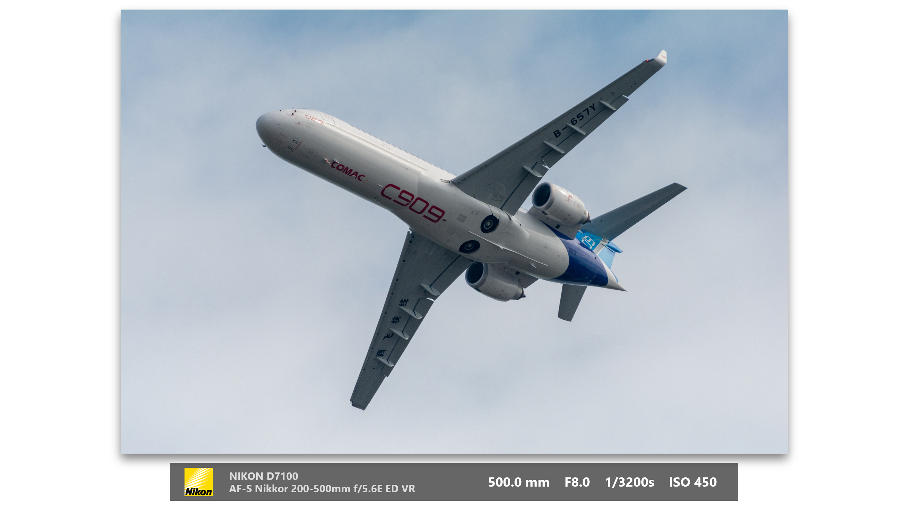

**[中文](README.MD)**
# PowerPoint Batch Banner Generation Macro for Photo Parameters

This is a PowerPoint VBA macro designed for photography enthusiasts and professionals. It can **batch process** multiple photos, automatically creating a new slide for each one and adding a professional, aesthetically pleasing banner with the photo's shooting parameters.

By pre-loading a CSV data file generated by ExifTool, this macro completely resolves EXIF data reading failures caused by system environment differences, ensuring extremely high operational stability and efficiency.

## Core Features

*   **Batch Processing**: Supports selecting multiple photos at once. The macro automatically creates a new slide for each photo and adds a banner, significantly improving efficiency.
*   **Excellent Performance**: Utilizes a one-time data loading mechanism. After the first run, all photo data is loaded into memory, ensuring swift responses even when processing a large number of photos.
*   **High Stability**: Bypasses compatibility issues by reading from an external CSV file instead of parsing image files directly.
*   **Intelligent Reporting**: After batch processing is complete, a clear report is provided, indicating how many files were processed successfully and which were skipped due to missing data.
*   **Professional Appearance**: Automatically adds a shadow effect to the images. The banner features a semi-transparent design with carefully arranged fonts and layout.
*   **Highly Configurable**: Users can easily modify the logo path, data file path, and fine-tune the banner layout.



## Workflow

Please strictly follow the four steps below for configuration and usage.

### Step 1: Preparation

1.  **ExifTool**: Download the `ExifTool` executable for Windows. After downloading from the official website ([https://exiftool.org/](https://exiftool.org/)), rename the `exiftool(-k).exe` file to `exiftool.exe`.
2.  **Camera Logo**:
    *   **Online Image (Default)**: The code uses an online Nikon logo link by default, which is convenient but requires an internet connection.
    *   **Local Image (Recommended)**: For faster loading speeds and offline convenience, it is recommended to download the logo image to your local machine and update the file path in the code (e.g., `C:\MyLogos\Nikon.jpg`).
    *   **Other Brands**: You can change the logo to that of another brand. This script does not support automatically switching camera brands.

### Step 2: Generate EXIF Data File

This is the most critical step in the entire process.

1.  Copy the `exiftool.exe` file into the root folder where **all** your photos are stored (e.g., `E:\images`).
2.  In that folder, hold down the `Shift` key and right-click, then select "Open PowerShell window here" or "Open command prompt here".
3.  **Sequentially** enter and execute the following two commands:

    *   The first command ensures that the command line can correctly handle Chinese characters:
      ```bash
      chcp 65001
      ```

    *   The second command runs ExifTool to scan all photos and generate the data file `exif_data.csv`:
      ```bash
      .\exiftool.exe -csv -r -charset filename=utf8 -FileName -Model -LensID -FocalLength -FNumber -ExposureTime -ISO . > exif_data.csv
      ```

4.  **Important**: After the command runs successfully, open the newly generated `exif_data.csv` file with **Notepad**. Then, select **File -> Save As**. In the dialog that appears, change the **Encoding** at the bottom to **`UTF-8 with BOM`**, then save and overwrite the original file. This step ensures that VBA can read the file content correctly.

### Step 3: Install and Configure the Macro in PowerPoint

1.  Open PowerPoint and press `Alt + F11` to enter the VBA Editor.
2.  In the editor's menu bar, click **Insert -> Module** to create a new, empty code module.
3.  Copy and paste the entire **[Complete Macro Code]** below into this new module.
4.  **Modify Configuration**: At the very top of the code, find and modify the following two constant lines, replacing the paths with your own actual paths:
    ```vb
    Const NIKON_LOGO_PATH As String = "https://i1.wp.com/..." ' Or change to a local path "C:\path\to\your\logo.jpg"
    Const CSV_FILE_PATH As String = "D:\path\to\your\photos\exif_data.csv"
    ```
5.  **Add a Shortcut (Recommended)**:
    *   Return to the main PowerPoint interface and click **File -> Options -> Quick Access Toolbar**.
    *   From the "Choose commands from" dropdown menu, select "Macros".
    *   Find the macro named `CreateBannersOnNewSlides_Batch` and click "Add".
    *   You can click "Modify" to choose a preferred icon for it.
    *   Click "OK" to save.

### Step 4: Run the Macro

Click the icon you just added to the Quick Access Toolbar. In the window that pops up, **hold down the `Ctrl` or `Shift` key to select one or more** photos you wish to insert, then click "Open" to begin the batch processing.

## Fine-Tuning

You can easily fine-tune the banner's layout to achieve the best visual effect. Find the `PositionAndCreateLayout` subroutine in the VBA code to make modifications.

**The following parameters have been adjusted by the author for optimal aesthetics, but you can modify them to suit your needs.**

1.  **Banner Width**:
    ```vb
    ' --- [Banner Width Adjustment] ---
    Const FIXED_BANNER_WIDTH As Single = 600 ' <-- Modify the width you desire here
    ```

2.  **Margin Between the Image and the Top/Bottom of the Slide (Safe Area)**:
    ```vb
    ' --- [Safe Area Adjustment] ---
    ' 0.87 means the total height of the image and banner will occupy at most 87% of the slide's height.
    ' Note that this whitespace includes the banner area.
    safeHeight = sldHeight * 0.87
    ```

---

## Complete Macro Code

```vb
Option Explicit

' --- Global Variables and Constants ---
Private exifCollection As Object
' !!! IMPORTANT: Please modify the following two paths according to your actual setup !!!
' The logo can be an online link, but for faster speed and offline use, it is recommended to download it locally and use a local path.
Const NIKON_LOGO_PATH As String = "https://i1.wp.com/naturebyandreas.se/wp-content/uploads/2015/10/nikon-logo.jpg"
Const CSV_FILE_PATH As String = "E:\images\exif_data.csv"

' =========================================================================
' --- Main Macro Procedure ---
' =========================================================================
Public Sub CreateBannersOnNewSlides_Batch()
    On Error GoTo ErrorHandler

    Dim fileDialog As Object
    Dim imagePath As Variant
    Dim imageName As String
    Dim oSlide As Slide
    Dim oPicture As Shape
    Dim exifData As Variant
    Dim processedCount As Long
    Dim failedFiles As String

    ' --- Step 1: Load all EXIF data at once ---
    If LoadExifData() = False Then Exit Sub

    ' --- Step 2: Open the file selection dialog and allow multi-select ---
    Set fileDialog = Application.fileDialog(msoFileDialogFilePicker)
    With fileDialog
        .Title = "Select one or more photo files (hold Ctrl or Shift)"
        .AllowMultiSelect = True
        .Filters.Clear
        .Filters.Add "Images", "*.JPG;*.JPEG"
        
        If .Show <> -1 Then
            MsgBox "Operation canceled.", vbInformation
            Exit Sub
        End If
    End With

    ' --- Step 3: Loop through and process each selected file ---
    processedCount = 0
    failedFiles = ""
    
    For Each imagePath In fileDialog.SelectedItems
        imageName = Mid(CStr(imagePath), InStrRev(CStr(imagePath), "\") + 1)

        If exifCollection.Exists(imageName) Then
            exifData = exifCollection(imageName)

            ' Create a new blank slide at the end for each picture
            Set oSlide = ActivePresentation.Slides.Add(ActivePresentation.Slides.Count + 1, ppLayoutBlank)
            Set oPicture = oSlide.Shapes.AddPicture(fileName:=CStr(imagePath), LinkToFile:=msoFalse, SaveWithDocument:=msoTrue, Left:=0, Top:=0)
            
            PositionAndCreateLayout oSlide, oPicture, exifData

            processedCount = processedCount + 1
        Else
            ' Record the filenames for which data was not found
            failedFiles = failedFiles & vbCrLf & " - " & imageName
        End If
    Next imagePath

    ' --- Step 4: Display the final processing report ---
    Dim finalMsg As String
    finalMsg = "Batch processing complete!" & vbCrLf & vbCrLf & "Successfully created new slides for " & processedCount & " images."
    
    If failedFiles <> "" Then
        finalMsg = finalMsg & vbCrLf & vbCrLf & "Data for the following files was not found in the CSV and they were skipped:" & failedFiles
    End If
    
    MsgBox finalMsg, vbInformation, "Processing Report"

    ' --- Clean up objects ---
    Set fileDialog = Nothing
    Set oPicture = Nothing
    Set oSlide = Nothing
    
    Exit Sub

ErrorHandler:
    MsgBox "A critical error occurred while running the macro: " & Err.Description, vbCritical, "Macro Error"
End Sub


' =========================================================================
' --- Subroutines ---
' =========================================================================
Private Sub PositionAndCreateLayout(ByRef sld As Slide, ByRef pic As Shape, ByVal data As Variant)
    ' --- [Banner Width Adjustment] ---
    Const FIXED_BANNER_WIDTH As Single = 600 ' <-- Modify the width you desire here

    Dim sldWidth As Single, sldHeight As Single
    Dim safeWidth As Single, safeHeight As Single
    Dim group As Shape
    Dim oBanner As Shape, oLogo As Shape, oTextBoxInfo As Shape, oTextBoxParams As Shape
    Dim infoText As String, paramsText As String
    Dim bannerHeight As Single, totalVisualHeight As Single, bannerTop As Single, bannerLeft As Single

    sldWidth = ActivePresentation.PageSetup.slideWidth
    sldHeight = ActivePresentation.PageSetup.slideHeight
    
    ' --- [Safe Area Adjustment] ---
    ' 0.87 means the total height of the image and banner will occupy at most 87% of the slide's height.
    ' Note that this whitespace includes the banner area.
    safeHeight = sldHeight * 0.87
    safeWidth = sldWidth * 0.95

    With pic
        .LockAspectRatio = msoTrue
        If (.Width / .Height) >= (safeWidth / safeHeight) Then
            .Width = safeWidth
        Else
            .Height = safeHeight
        End If
        
        With .Shadow
            .Type = msoShadow26
            .Visible = msoTrue
            .Blur = 12
            .Transparency = 0.5
            .OffsetX = 0
            .OffsetY = 6
        End With
    End With

    infoText = CStr(data(0)) & vbCrLf & CStr(data(1))
    paramsText = CStr(data(2)) & "    F" & CStr(data(3)) & "    " & CStr(data(4)) & "s    " & CStr(data(5))
    
    bannerHeight = 40
    totalVisualHeight = pic.Height + 10 + bannerHeight
    
    pic.Left = (sldWidth - pic.Width) / 2
    bannerLeft = (sldWidth - FIXED_BANNER_WIDTH) / 2
    
    pic.Top = (sldHeight - totalVisualHeight) / 2
    
    bannerTop = pic.Top + pic.Height + 10
    
    Set oBanner = sld.Shapes.AddShape(msoShapeRectangle, bannerLeft, bannerTop, FIXED_BANNER_WIDTH, bannerHeight)
    With oBanner
        .Fill.ForeColor.RGB = RGB(0, 0, 0)
        .Fill.Transparency = 0.4
        .line.Visible = msoFalse
    End With
    
    Set oLogo = sld.Shapes.AddPicture(NIKON_LOGO_PATH, msoFalse, msoTrue, 0, 0)
    With oLogo
        .LockAspectRatio = msoTrue
        .Height = 30
        .Left = oBanner.Left + 15
        .Top = oBanner.Top + (oBanner.Height - .Height) / 2
    End With
    
    Set oTextBoxInfo = sld.Shapes.AddTextbox(msoTextOrientationHorizontal, oLogo.Left + oLogo.Width + 10, oBanner.Top, oBanner.Width * 0.5, bannerHeight)
    With oTextBoxInfo.TextFrame2
        .VerticalAnchor = msoAnchorMiddle
        .TextRange.Text = infoText
        .TextRange.Font.Name = "Segoe UI"
        .TextRange.Font.Size = 11
        .TextRange.Font.Fill.ForeColor.RGB = RGB(220, 220, 220)
        .TextRange.Font.Bold = msoTrue
    End With
    
    Set oTextBoxParams = sld.Shapes.AddTextbox(msoTextOrientationHorizontal, oBanner.Left + oBanner.Width * 0.5, oBanner.Top, oBanner.Width * 0.5 - 15, bannerHeight)
    With oTextBoxParams.TextFrame2
        .VerticalAnchor = msoAnchorMiddle
        .TextRange.Text = paramsText
        .TextRange.ParagraphFormat.Alignment = msoAlignRight
        .TextRange.Font.Name = "Segoe UI"
        .TextRange.Font.Size = 14
        .TextRange.Font.Fill.ForeColor.RGB = RGB(255, 255, 255)
        .TextRange.Font.Bold = msoTrue
    End With
    
    Set group = sld.Shapes.Range(Array(pic.Name, oBanner.Name, oLogo.Name, oTextBoxInfo.Name, oTextBoxParams.Name)).group

    Set oBanner = Nothing
    Set oLogo = Nothing
    Set oTextBoxInfo = Nothing
    Set oTextBoxParams = Nothing
    Set group = Nothing
End Sub


' =========================================================================
' --- Data Loading Function ---
' =========================================================================
Private Function LoadExifData() As Boolean
    On Error GoTo LoadError
    
    If Not exifCollection Is Nothing Then LoadExifData = True: Exit Function
    
    If Dir(CSV_FILE_PATH) = "" Then
        MsgBox "Error: Data file not found!" & vbCrLf & CSV_FILE_PATH, vbCritical, "Data File Missing"
        LoadExifData = False: Exit Function
    End If
    
    Dim adoStream As Object, line As String, columns() As String, key As String, value As Variant
    Set adoStream = CreateObject("ADODB.Stream")
    With adoStream: .Type = 2: .Charset = "UTF-8": .Open: .LoadFromFile CSV_FILE_PATH: End With
    
    Set exifCollection = CreateObject("Scripting.Dictionary")
    exifCollection.CompareMode = vbTextCompare
    
    If Not adoStream.EOS Then line = adoStream.ReadText(-2) ' Skip header
    
    Do Until adoStream.EOS
        line = adoStream.ReadText(-2)
        columns = Split(line, ",")
        If UBound(columns) >= 7 Then
            key = Trim(Replace(columns(1), """", ""))
            value = Array(CStr(columns(2)), CStr(columns(3)), CStr(columns(4)), CStr(columns(5)), CStr(columns(6)), "ISO " & CStr(columns(7)))
            If Not exifCollection.Exists(key) Then exifCollection.Add key, value
        End If
    Loop
    
    adoStream.Close: Set adoStream = Nothing
    LoadExifData = True
    Exit Function
    
LoadError:
    MsgBox "An error occurred while loading EXIF data: " & Err.Description, vbCritical, "Load Data Error"
    LoadExifData = False
    If Not adoStream Is Nothing Then
        If adoStream.State = 1 Then adoStream.Close
        Set adoStream = Nothing
    End If
End Function
```